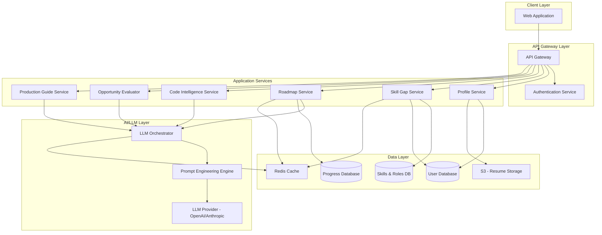

# Design Document: AI-Powered Career Development Platform

## Overview

The AI-powered career development platform is a web-based system that helps college students and early-stage developers bridge the gap between their current skills and career goals. The platform leverages AI/LLM capabilities to provide personalized skill gap analysis, structured learning roadmaps, native language code explanations, opportunity evaluation, and production development guidance.

The system follows a microservices architecture deployed on AWS, with clear separation between the API layer, AI processing services, data storage, and frontend application. The design prioritizes scalability, security, and sub-5-second response times for AI-powered features.

### Key Design Principles

1. **AI-First Architecture**: LLM integration at the core for personalization and intelligence
2. **Modular Services**: Independent services for each major feature area
3. **Performance-Oriented**: Caching and optimization for <5s response times
4. **Security by Design**: Encryption, access control, and audit logging throughout
5. **Scalability**: Horizontal scaling support for concurrent users
6. **Multi-Language Support**: Internationalization built into all user-facing components

## Architecture

### High-Level Architecture



### Technology Stack

**Frontend:**
- React with TypeScript for type safety
- React Router for navigation
- Axios for API communication
- i18next for internationalization
- Tailwind CSS for styling

**Backend Services:**
- Node.js with Express for API services
- Python with FastAPI for AI/LLM services
- JWT for authentication
- AWS SDK for cloud service integration

**AI/LLM:**
- OpenAI GPT-4 or Anthropic Claude for primary LLM
- LangChain for prompt management and orchestration
- Semantic caching for response optimization

**Data Storage:**
- PostgreSQL for relational data (users, progress, skills)
- Redis for caching and session management
- AWS S3 for resume document storage
- AWS RDS for managed PostgreSQL

**Infrastructure:**
- AWS ECS/Fargate for container orchestration
- AWS API Gateway for API management
- AWS CloudFront for CDN
- AWS CloudWatch for monitoring and logging
- AWS Secrets Manager for credential management

## Components and Interfaces

### 1. Profile Service

**Responsibility:** Manages user profiles, resume parsing, and educational information.

**Key Operations:**
- `createProfile(userData: UserProfile): ProfileId`
- `uploadResume(userId: ProfileId, resumeFile: File): ResumeData`
- `parseResume(resumeFile: File): ParsedResumeData`
- `updateSkillAssessment(userId: ProfileId, skills: SkillRatings): void`
- `setTargetRole(userId: ProfileId, role: TargetRole): void`
- `getProfile(userId: ProfileId): UserProfile`

**Interface:**
```typescript
interface UserProfile {
  userId: string;
  email: string;
  name: string;
  degreeInfo: DegreeInfo;
  skillRatings: SkillRatings;
  targetRole: TargetRole;
  resumeUrl?: string;
  createdAt: Date;
  updatedAt: Date;
}

interface DegreeInfo {
  degreeType: string;
  institution: string;
  major: string;
  graduationYear: number;
}

interface SkillRatings {
  dsa: number;        // 0-10 scale
  backend: number;
  cloud: number;
  systemDesign: number;
  programming: number;
}

type TargetRole = 'Backend Engineer' | 'SDE' | 'AI/ML Engineer' | 'Full Stack Developer';

interface ParsedResumeData {
  education: DegreeInfo[];
  workExperience: WorkExperience[];
  skills: string[];
  projects: Project[];
}
```

**Dependencies:**
- AWS S3 for resume storage
- LLM service for resume parsing
- User database for profile persistence

### 2. Skill Gap Service

**Responsibility:** Analyzes skill gaps and calculates readiness scores.

**Key Operations:**
- `analyzeSkillGap(userId: ProfileId): SkillGapAnalysis`
- `calculateReadinessScore(currentSkills: SkillRatings, targetRole: TargetRole): number`
- `getRoleRequirements(role: TargetRole): RoleRequirements`
- `prioritizeGaps(gaps: SkillGap[]): PrioritizedGap[]`

**Interface:**
```typescript
interface SkillGapAnalysis {
  userId: string;
  targetRole: TargetRole;
  readinessScore: number;  // 0-100
  skillGaps: SkillGap[];
  prioritizedGaps: PrioritizedGap[];
  generatedAt: Date;
}

interface SkillGap {
  domain: SkillDomain;
  currentLevel: number;
  requiredLevel: number;
  gapSize: number;
}

interface PrioritizedGap extends SkillGap {
  priority: 'Critical' | 'High' | 'Medium' | 'Low';
  impactScore: number;
}

interface RoleRequirements {
  role: TargetRole;
  requiredSkills: {
    [key in SkillDomain]: number;
  };
  description: string;
}

type SkillDomain = 'dsa' | 'backend' | 'cloud' | 'systemDesign' | 'programming';
```

**Algorithm for Readiness Score:**
```
readinessScore = Σ(min(currentSkill[i], requiredSkill[i]) / requiredSkill[i] * weight[i]) * 100

where:
- weight[i] = importance of skill domain for target role
- Sum of all weights = 1.0
```

**Dependencies:**
- Skills database for role requirements
- User database for current skill ratings
- Redis cache for frequently accessed role requirements

### 3. Roadmap Service

**Responsibility:** Generates personalized learning roadmaps and tracks progress.

**Key Operations:**
- `generateRoadmap(userId: ProfileId, duration: number): Roadmap`
- `updateProgress(userId: ProfileId, taskId: string, completed: boolean): void`
- `getProgress(userId: ProfileId): RoadmapProgress`
- `adjustRoadmap(userId: ProfileId, adjustments: RoadmapAdjustments): Roadmap`
- `getMilestones(roadmapId: string): Milestone[]`

**Interface:**
```typescript
interface Roadmap {
  roadmapId: string;
  userId: string;
  duration: number;  // days
  startDate: Date;
  endDate: Date;
  weeklyMilestones: Milestone[];
  dailyPlans: DailyPlan[];
  createdAt: Date;
}

interface Milestone {
  week: number;
  description: string;
  measurableOutcome: string;
  skills: SkillDomain[];
}

interface DailyPlan {
  day: number;
  date: Date;
  tasks: Task[];
  totalEstimatedTime: number;  // minutes (120-240)
}

interface Task {
  taskId: string;
  type: 'DSA' | 'Project' | 'Learning' | 'Interview Prep';
  title: string;
  description: string;
  resources: Resource[];
  estimatedTime: number;  // minutes
  completed: boolean;
  skillDomains: SkillDomain[];
}

interface Resource {
  type: 'Article' | 'Video' | 'Documentation' | 'Problem';
  title: string;
  url: string;
}

interface RoadmapProgress {
  roadmapId: string;
  completionRate: number;  // 0-100
  currentStreak: number;  // days
  tasksCompleted: number;
  tasksTotal: number;
  currentReadinessScore: number;
  initialReadinessScore: number;
}
```

**Roadmap Generation Strategy:**
1. Retrieve skill gap analysis
2. Calculate daily time budget (2-4 hours)
3. Generate LLM prompt with user context, gaps, and constraints
4. Parse LLM response into structured roadmap
5. Validate time constraints and adjust if needed
6. Store roadmap and return to user

**Dependencies:**
- LLM Orchestrator for roadmap generation
- Skill Gap Service for gap analysis
- Progress database for tracking
- Redis cache for active roadmaps

### 4. Code Intelligence Service

**Responsibility:** Provides native language code explanations and analysis.

**Key Operations:**
- `explainCode(code: string, language: ProgrammingLanguage, nativeLanguage: NativeLanguage): CodeExplanation`
- `analyzeComplexity(code: string, language: ProgrammingLanguage): ComplexityAnalysis`
- `dryRunCode(code: string, language: ProgrammingLanguage, sampleInput: any, nativeLanguage: NativeLanguage): DryRunResult`
- `suggestImprovements(code: string, language: ProgrammingLanguage, nativeLanguage: NativeLanguage): Improvement[]`

**Interface:**
```typescript
interface CodeExplanation {
  code: string;
  language: ProgrammingLanguage;
  lineByLineExplanation: LineExplanation[];
  overallSummary: string;
  nativeLanguage: NativeLanguage;
}

interface LineExplanation {
  lineNumber: number;
  code: string;
  explanation: string;
}

interface ComplexityAnalysis {
  timeComplexity: string;  // e.g., "O(n log n)"
  spaceComplexity: string;
  explanation: string;
}

interface DryRunResult {
  steps: ExecutionStep[];
  finalOutput: any;
  explanation: string;
}

interface ExecutionStep {
  stepNumber: number;
  lineNumber: number;
  variableStates: { [key: string]: any };
  explanation: string;
}

interface Improvement {
  category: 'Performance' | 'Readability' | 'Best Practice' | 'Security';
  description: string;
  suggestedCode?: string;
  impact: 'High' | 'Medium' | 'Low';
}

type ProgrammingLanguage = 'Python' | 'JavaScript' | 'Java' | 'C++' | 'Go';
type NativeLanguage = 'English' | 'Hindi' | 'Telugu' | 'Tamil' | 'Bengali';
```

**Dependencies:**
- LLM Orchestrator for code analysis
- Prompt Engine for multi-language prompts
- Redis cache for common code patterns

### 5. Opportunity Evaluator Service

**Responsibility:** Evaluates college events and opportunities for relevance.

**Key Operations:**
- `evaluateOpportunity(userId: ProfileId, opportunityDescription: string): OpportunityEvaluation`
- `calculateAlignmentScore(opportunity: Opportunity, userContext: UserContext): number`
- `calculateROIScore(opportunity: Opportunity, timeInvestment: number): number`
- `identifySkillImpact(opportunity: Opportunity): SkillDomain[]`

**Interface:**
```typescript
interface OpportunityEvaluation {
  opportunityDescription: string;
  alignmentScore: number;  // 0-100
  roiScore: number;  // 0-100
  skillImpact: SkillImpact[];
  recommendation: 'Participate' | 'Skip' | 'Consider';
  justification: string;
  evaluatedAt: Date;
}

interface SkillImpact {
  domain: SkillDomain;
  impactLevel: 'High' | 'Medium' | 'Low';
  description: string;
}

interface Opportunity {
  title: string;
  description: string;
  type: 'Hackathon' | 'Workshop' | 'Conference' | 'Competition' | 'Networking';
  duration: number;  // hours
  skills: string[];
}

interface UserContext {
  targetRole: TargetRole;
  currentSkills: SkillRatings;
  skillGaps: SkillGap[];
  roadmapTasks: Task[];
}
```

**Dependencies:**
- LLM Orchestrator for opportunity analysis
- Skill Gap Service for user context
- Roadmap Service for current plan

### 6. Production Guide Service

**Responsibility:** Provides guidance for building production-ready applications.

**Key Operations:**
- `breakdownProject(projectIdea: string, userContext: UserContext): ProjectBreakdown`
- `suggestTechStack(projectRequirements: Requirements, userSkills: SkillRatings, targetRole: TargetRole): TechStack`
- `generateArchitecture(projectRequirements: Requirements): ArchitecturePlan`
- `createWorkflowSteps(projectBreakdown: ProjectBreakdown): WorkflowStep[]`
- `reviewCode(code: string, language: ProgrammingLanguage): CodeReview`

**Interface:**
```typescript
interface ProjectBreakdown {
  projectIdea: string;
  mvpScope: string;
  functionalRequirements: string[];
  nonFunctionalRequirements: NFRequirement[];
  estimatedComplexity: 'Beginner' | 'Intermediate' | 'Advanced';
}

interface NFRequirement {
  category: 'Performance' | 'Security' | 'Scalability' | 'Maintainability';
  description: string;
  priority: 'Must Have' | 'Should Have' | 'Nice to Have';
}

interface TechStack {
  frontend: Technology[];
  backend: Technology[];
  database: Technology[];
  infrastructure: Technology[];
  justification: string;
}

interface Technology {
  name: string;
  purpose: string;
  learningCurve: 'Easy' | 'Moderate' | 'Steep';
  alignsWithRole: boolean;
}

interface ArchitecturePlan {
  components: Component[];
  dataFlow: string;
  diagram: string;  // Mermaid diagram
  scalabilityConsiderations: string[];
  securityConsiderations: string[];
}

interface Component {
  name: string;
  responsibility: string;
  interfaces: string[];
}

interface WorkflowStep {
  phase: number;
  title: string;
  tasks: string[];
  deliverables: string[];
  estimatedDuration: string;
}

interface CodeReview {
  overallScore: number;  // 0-100
  productionReadiness: 'Ready' | 'Needs Work' | 'Not Ready';
  issues: CodeIssue[];
  optimizations: Optimization[];
}

interface CodeIssue {
  severity: 'Critical' | 'High' | 'Medium' | 'Low';
  category: 'Security' | 'Performance' | 'Maintainability' | 'Best Practice';
  description: string;
  lineNumber?: number;
  suggestion: string;
}

interface Optimization {
  type: 'Performance' | 'Code Quality' | 'Architecture';
  description: string;
  impact: 'High' | 'Medium' | 'Low';
  suggestedApproach: string;
}
```

**Dependencies:**
- LLM Orchestrator for project analysis
- User profile for skill context
- Skill Gap Service for alignment

### 7. LLM Orchestrator

**Responsibility:** Manages all LLM interactions, prompt engineering, and response caching.

**Key Operations:**
- `generateCompletion(prompt: string, context: LLMContext, options: LLMOptions): string`
- `getCachedResponse(promptHash: string): string | null`
- `cacheResponse(promptHash: string, response: string, ttl: number): void`
- `buildPrompt(template: string, variables: Record<string, any>): string`
- `parseStructuredResponse(response: string, schema: JSONSchema): any`

**Interface:**
```typescript
interface LLMContext {
  userId?: string;
  userProfile?: UserProfile;
  skillGaps?: SkillGap[];
  targetRole?: TargetRole;
  nativeLanguage?: NativeLanguage;
}

interface LLMOptions {
  model: string;
  temperature: number;
  maxTokens: number;
  useCache: boolean;
  cacheTTL?: number;  // seconds
}

interface PromptTemplate {
  templateId: string;
  template: string;
  variables: string[];
  category: 'Roadmap' | 'CodeExplanation' | 'Opportunity' | 'Production';
}
```

**Caching Strategy:**
- Semantic caching for similar prompts
- Cache key: hash of (prompt template + normalized variables)
- TTL varies by use case:
  - Code explanations: 7 days
  - Roadmaps: 1 day (personalized)
  - Opportunity evaluations: 3 days
  - Production guidance: 7 days

**Dependencies:**
- OpenAI/Anthropic API
- Redis for caching
- Prompt template database

### 8. Authentication Service

**Responsibility:** Handles user authentication and authorization.

**Key Operations:**
- `register(email: string, password: string, name: string): AuthToken`
- `login(email: string, password: string): AuthToken`
- `verifyToken(token: string): TokenPayload`
- `refreshToken(refreshToken: string): AuthToken`
- `logout(token: string): void`

**Interface:**
```typescript
interface AuthToken {
  accessToken: string;
  refreshToken: string;
  expiresIn: number;
  tokenType: 'Bearer';
}

interface TokenPayload {
  userId: string;
  email: string;
  role: 'user' | 'admin';
  iat: number;
  exp: number;
}
```

**Security Measures:**
- JWT tokens with RS256 signing
- Access tokens expire in 1 hour
- Refresh tokens expire in 7 days
- Password hashing with bcrypt (cost factor 12)
- Rate limiting on authentication endpoints

## Data Models

### User Schema (PostgreSQL)

```sql
CREATE TABLE users (
  user_id UUID PRIMARY KEY DEFAULT gen_random_uuid(),
  email VARCHAR(255) UNIQUE NOT NULL,
  password_hash VARCHAR(255) NOT NULL,
  name VARCHAR(255) NOT NULL,
  native_language VARCHAR(50) DEFAULT 'English',
  created_at TIMESTAMP DEFAULT CURRENT_TIMESTAMP,
  updated_at TIMESTAMP DEFAULT CURRENT_TIMESTAMP
);

CREATE TABLE user_profiles (
  profile_id UUID PRIMARY KEY DEFAULT gen_random_uuid(),
  user_id UUID REFERENCES users(user_id) ON DELETE CASCADE,
  degree_type VARCHAR(100),
  institution VARCHAR(255),
  major VARCHAR(100),
  graduation_year INTEGER,
  target_role VARCHAR(100),
  resume_s3_key VARCHAR(500),
  created_at TIMESTAMP DEFAULT CURRENT_TIMESTAMP,
  updated_at TIMESTAMP DEFAULT CURRENT_TIMESTAMP
);

CREATE TABLE skill_ratings (
  rating_id UUID PRIMARY KEY DEFAULT gen_random_uuid(),
  user_id UUID REFERENCES users(user_id) ON DELETE CASCADE,
  dsa INTEGER CHECK (dsa BETWEEN 0 AND 10),
  backend INTEGER CHECK (backend BETWEEN 0 AND 10),
  cloud INTEGER CHECK (cloud BETWEEN 0 AND 10),
  system_design INTEGER CHECK (system_design BETWEEN 0 AND 10),
  programming INTEGER CHECK (programming BETWEEN 0 AND 10),
  created_at TIMESTAMP DEFAULT CURRENT_TIMESTAMP,
  updated_at TIMESTAMP DEFAULT CURRENT_TIMESTAMP
);

CREATE TABLE roadmaps (
  roadmap_id UUID PRIMARY KEY DEFAULT gen_random_uuid(),
  user_id UUID REFERENCES users(user_id) ON DELETE CASCADE,
  duration INTEGER NOT NULL,
  start_date DATE NOT NULL,
  end_date DATE NOT NULL,
  initial_readiness_score INTEGER,
  current_readiness_score INTEGER,
  created_at TIMESTAMP DEFAULT CURRENT_TIMESTAMP
);

CREATE TABLE daily_plans (
  plan_id UUID PRIMARY KEY DEFAULT gen_random_uuid(),
  roadmap_id UUID REFERENCES roadmaps(roadmap_id) ON DELETE CASCADE,
  day_number INTEGER NOT NULL,
  plan_date DATE NOT NULL,
  total_estimated_time INTEGER,
  created_at TIMESTAMP DEFAULT CURRENT_TIMESTAMP
);

CREATE TABLE tasks (
  task_id UUID PRIMARY KEY DEFAULT gen_random_uuid(),
  plan_id UUID REFERENCES daily_plans(plan_id) ON DELETE CASCADE,
  task_type VARCHAR(50) NOT NULL,
  title VARCHAR(255) NOT NULL,
  description TEXT,
  estimated_time INTEGER,
  completed BOOLEAN DEFAULT FALSE,
  completed_at TIMESTAMP,
  created_at TIMESTAMP DEFAULT CURRENT_TIMESTAMP
);

CREATE TABLE milestones (
  milestone_id UUID PRIMARY KEY DEFAULT gen_random_uuid(),
  roadmap_id UUID REFERENCES roadmaps(roadmap_id) ON DELETE CASCADE,
  week_number INTEGER NOT NULL,
  description TEXT NOT NULL,
  measurable_outcome TEXT NOT NULL,
  achieved BOOLEAN DEFAULT FALSE,
  created_at TIMESTAMP DEFAULT CURRENT_TIMESTAMP
);

CREATE TABLE role_requirements (
  requirement_id UUID PRIMARY KEY DEFAULT gen_random_uuid(),
  role_name VARCHAR(100) UNIQUE NOT NULL,
  dsa_required INTEGER NOT NULL,
  backend_required INTEGER NOT NULL,
  cloud_required INTEGER NOT NULL,
  system_design_required INTEGER NOT NULL,
  programming_required INTEGER NOT NULL,
  dsa_weight DECIMAL(3,2) NOT NULL,
  backend_weight DECIMAL(3,2) NOT NULL,
  cloud_weight DECIMAL(3,2) NOT NULL,
  system_design_weight DECIMAL(3,2) NOT NULL,
  programming_weight DECIMAL(3,2) NOT NULL,
  description TEXT
);

CREATE TABLE analytics_events (
  event_id UUID PRIMARY KEY DEFAULT gen_random_uuid(),
  user_id UUID REFERENCES users(user_id) ON DELETE CASCADE,
  event_type VARCHAR(100) NOT NULL,
  event_data JSONB,
  created_at TIMESTAMP DEFAULT CURRENT_TIMESTAMP
);

CREATE INDEX idx_users_email ON users(email);
CREATE INDEX idx_roadmaps_user_id ON roadmaps(user_id);
CREATE INDEX idx_tasks_plan_id ON tasks(plan_id);
CREATE INDEX idx_analytics_user_id ON analytics_events(user_id);
CREATE INDEX idx_analytics_event_type ON analytics_events(event_type);
```

### Redis Cache Structure

```
# User session
session:{userId} -> { accessToken, refreshToken, expiresAt }
TTL: 1 hour

# Role requirements cache
role:requirements:{roleName} -> RoleRequirements JSON
TTL: 24 hours

# LLM response cache
llm:cache:{promptHash} -> response string
TTL: varies by use case (1-7 days)

# Active roadmap cache
roadmap:active:{userId} -> Roadmap JSON
TTL: 24 hours

# Skill gap analysis cache
skillgap:{userId} -> SkillGapAnalysis JSON
TTL: 1 hour
```

### S3 Bucket Structure

```
career-platform-resumes/
  {userId}/
    original/
      resume_{timestamp}.pdf
    parsed/
      resume_{timestamp}.json
```

## Correctness Properties


*A property is a characteristic or behavior that should hold true across all valid executions of a system—essentially, a formal statement about what the system should do. Properties serve as the bridge between human-readable specifications and machine-verifiable correctness guarantees.*

### Property 1: Resume Data Round-Trip Integrity

*For any* valid resume uploaded and stored, retrieving and decrypting the resume data should produce content equivalent to the original upload.

**Validates: Requirements 1.1, 1.2, 9.1**

### Property 2: Skill Rating Validation

*For any* skill rating submission, if all domain values are within the valid range (0-10), the system should accept the ratings; if any value is outside this range, the system should reject the entire submission.

**Validates: Requirements 1.3**

### Property 3: Target Role Validation

*For any* role selection attempt, the system should accept the role if and only if it matches one of the supported target roles (Backend Engineer, SDE, AI/ML Engineer, Full Stack Developer).

**Validates: Requirements 1.4**

### Property 4: Readiness Score Bounds

*For any* skill gap analysis, the calculated readiness score must be between 0 and 100 inclusive, regardless of input skill ratings or target role.

**Validates: Requirements 2.2**

### Property 5: Skill Gap Completeness

*For any* skill gap analysis result, all five skill domains (DSA, Backend, Cloud, System Design, Programming) must be represented in the gap analysis output.

**Validates: Requirements 2.3**

### Property 6: Gap Prioritization Consistency

*For any* set of skill gaps, if gap A has a higher impact score than gap B, then gap A must appear before gap B in the prioritized list.

**Validates: Requirements 2.4**

### Property 7: Roadmap Duration Bounds

*For any* generated roadmap, the duration must be between 30 and 90 days inclusive.

**Validates: Requirements 3.1**

### Property 8: Daily Time Budget Constraint

*For any* daily plan in a roadmap, the sum of estimated times for all tasks must be between 120 and 240 minutes (2-4 hours).

**Validates: Requirements 3.2**

### Property 9: Weekly Milestone Completeness

*For any* roadmap with duration D days, the number of weekly milestones should be equal to ceil(D / 7), ensuring every week has a milestone.

**Validates: Requirements 3.3**

### Property 10: DSA Difficulty Progression

*For any* sequence of DSA tasks in a roadmap, the difficulty level should be monotonically non-decreasing (each task is at least as difficult as the previous one).

**Validates: Requirements 3.4**

### Property 11: Project-Role Alignment

*For any* project included in a roadmap, at least one of the project's skill domains must match a skill domain required by the user's target role.

**Validates: Requirements 3.5**

### Property 12: Interview Prep Completeness

*For any* roadmap that includes interview preparation tasks, both behavioral and technical interview task types must be present.

**Validates: Requirements 3.6**

### Property 13: Daily Plan Structure Completeness

*For any* daily plan, it must contain at least one task, and each task must have a title, description, estimated time, and at least one resource.

**Validates: Requirements 3.8**

### Property 14: Progress Monotonicity

*For any* task completion event, the roadmap completion percentage must either increase or remain at 100%, never decrease.

**Validates: Requirements 4.1**

### Property 15: Readiness Score Monotonicity

*For any* milestone completion event, the user's readiness score must either increase or remain unchanged, never decrease.

**Validates: Requirements 4.2**

### Property 16: Progress View Completeness

*For any* progress view request, the response must include completion rate, current streak, and a list of upcoming tasks (or empty list if none remain).

**Validates: Requirements 4.3**

### Property 17: Progress Persistence Round-Trip

*For any* progress update (task completion or milestone achievement), storing the update and immediately retrieving progress should reflect the completed state.

**Validates: Requirements 4.5**

### Property 18: Code Explanation Completeness

*For any* code submission for explanation, the response must contain an explanation entry for each line of code in the specified native language.

**Validates: Requirements 5.1**

### Property 19: Complexity Analysis Presence

*For any* code analysis request, the response must include both time complexity and space complexity values in Big-O notation.

**Validates: Requirements 5.2**

### Property 20: Dry Run Variable Tracking

*For any* dry run execution, each execution step must include the current state of all variables that have been declared up to that point.

**Validates: Requirements 5.3**

### Property 21: Code Review Improvement Suggestions

*For any* code review request, the response must include at least one improvement suggestion in one of the categories: Performance, Readability, Best Practice, or Security.

**Validates: Requirements 5.4**

### Property 22: Opportunity Score Bounds

*For any* opportunity evaluation, both the alignment score and ROI score must be between 0 and 100 inclusive.

**Validates: Requirements 6.1, 6.2**

### Property 23: Opportunity Skill Impact Identification

*For any* opportunity evaluation, the result must identify at least one skill domain that will be impacted, or explicitly state that no skills are impacted.

**Validates: Requirements 6.3**

### Property 24: Opportunity Recommendation Completeness

*For any* opportunity evaluation, the result must include a recommendation (Participate, Skip, or Consider) and a non-empty justification string.

**Validates: Requirements 6.4**

### Property 25: Project Breakdown Completeness

*For any* project idea submission, the breakdown must include an MVP scope description, at least one functional requirement, and at least one non-functional requirement.

**Validates: Requirements 7.1, 7.2**

### Property 26: Architecture Plan Structure

*For any* architecture plan, it must include at least one component, a data flow description, and a diagram representation.

**Validates: Requirements 7.3**

### Property 27: Tech Stack Role Alignment

*For any* tech stack suggestion, at least 50% of the suggested technologies must have the alignsWithRole flag set to true for the user's target role.

**Validates: Requirements 7.4**

### Property 28: Workflow Phase Sequence

*For any* production workflow, it must contain at least 3 phases, and each phase must have a sequential phase number starting from 1.

**Validates: Requirements 7.5**

### Property 29: Code Review Optimization Presence

*For any* code review, the result must include at least one optimization suggestion.

**Validates: Requirements 7.6**

### Property 30: Encrypted Storage Verification

*For any* sensitive data stored (resume content, personal information), the stored representation must not equal the plaintext input, and decrypting the stored data must produce the original plaintext.

**Validates: Requirements 9.1**

### Property 31: Data Deletion Completeness

*For any* user account deletion, querying for that user's profile, roadmaps, tasks, and analytics after the deletion process should return no results.

**Validates: Requirements 9.3**

### Property 32: Access Control Enforcement

*For any* data access attempt, if the requesting component has the required role/permission, access should succeed; if not, access should be denied with an authorization error.

**Validates: Requirements 9.4**

### Property 33: Sensitive Data Access Logging

*For any* access to sensitive data (resume, personal information), an audit log entry must be created with timestamp, accessor identity, and resource accessed.

**Validates: Requirements 9.5**

### Property 34: Backup Existence

*For any* data written to persistent storage, a backup copy must exist in the backup system within the backup interval.

**Validates: Requirements 10.4**

### Property 35: Critical Issue Alerting

*For any* critical system issue (service down, error rate spike, resource exhaustion), an alert must be generated and sent to administrators.

**Validates: Requirements 10.5**

### Property 36: Operation Logging

*For any* significant operation (user registration, roadmap generation, skill gap analysis), a log entry must be created with operation type, timestamp, and outcome.

**Validates: Requirements 10.6**

### Property 37: Language Preference Persistence

*For any* language preference selection, storing the preference and retrieving it in a subsequent session should return the same language choice.

**Validates: Requirements 11.2**

### Property 38: Readiness Score Tracking

*For any* user with activity spanning at least 30 days, the analytics system must have recorded at least two readiness score data points (initial and current).

**Validates: Requirements 12.1**

### Property 39: Completion Rate Calculation

*For any* roadmap, the completion rate must equal (number of completed tasks / total number of tasks) * 100, and must be between 0 and 100 inclusive.

**Validates: Requirements 12.2**

### Property 40: Session Tracking

*For any* user login and activity, an analytics event must be recorded with user ID, session start time, and event type.

**Validates: Requirements 12.3**

### Property 41: Adherence Rate Bounds

*For any* roadmap adherence calculation, the adherence rate must be between 0 and 100 inclusive, representing the percentage of tasks completed on or before their scheduled date.

**Validates: Requirements 12.4**

### Property 42: Interview Outcome Recording

*For any* interview outcome report submitted by a user, an analytics event must be created and stored with the outcome data.

**Validates: Requirements 12.5**

### Property 43: Analytics Privacy Preservation

*For any* aggregated analytics query result, the response must not contain any individual user identifiers (user ID, email, name) in the aggregated data.

**Validates: Requirements 12.6**

## Error Handling

### Error Categories

The platform implements comprehensive error handling across all services:

**1. Validation Errors (400 Bad Request)**
- Invalid skill ratings (out of range)
- Invalid target role selection
- Malformed resume files
- Invalid date ranges for roadmaps
- Missing required fields

**2. Authentication Errors (401 Unauthorized)**
- Invalid or expired JWT tokens
- Missing authentication credentials
- Invalid login credentials

**3. Authorization Errors (403 Forbidden)**
- Insufficient permissions for resource access
- Attempting to access another user's data

**4. Resource Not Found (404 Not Found)**
- User profile not found
- Roadmap not found
- Task not found

**5. Rate Limiting (429 Too Many Requests)**
- Exceeded API rate limits
- Too many LLM requests in time window

**6. External Service Errors (502 Bad Gateway)**
- LLM provider unavailable
- Database connection failures
- S3 storage unavailable

**7. Internal Server Errors (500 Internal Server Error)**
- Unexpected application errors
- Unhandled exceptions

### Error Response Format

All errors follow a consistent JSON structure:

```typescript
interface ErrorResponse {
  error: {
    code: string;           // Machine-readable error code
    message: string;        // Human-readable error message
    details?: any;          // Additional error context
    timestamp: string;      // ISO 8601 timestamp
    requestId: string;      // Unique request identifier for tracing
  };
}
```

### Error Handling Strategies

**Retry Logic:**
- LLM requests: 3 retries with exponential backoff (1s, 2s, 4s)
- Database operations: 2 retries with 500ms delay
- S3 operations: 3 retries with exponential backoff

**Circuit Breaker:**
- LLM service: Open circuit after 5 consecutive failures, half-open after 30s
- Database: Open circuit after 10 consecutive failures, half-open after 10s

**Fallback Mechanisms:**
- LLM cache: Return cached response if LLM unavailable
- Skill gap analysis: Use cached role requirements if database unavailable
- Roadmap generation: Provide template-based roadmap if LLM fails

**Graceful Degradation:**
- Code intelligence: Return basic syntax highlighting if LLM unavailable
- Opportunity evaluation: Return neutral scores if analysis fails
- Analytics: Queue events for later processing if analytics service unavailable

### Logging and Monitoring

**Log Levels:**
- ERROR: All errors that impact user experience
- WARN: Degraded functionality, retry attempts
- INFO: Successful operations, key business events
- DEBUG: Detailed execution flow (development only)

**Monitored Metrics:**
- API response times (p50, p95, p99)
- Error rates by endpoint and error type
- LLM request latency and token usage
- Database query performance
- Cache hit rates
- Active user sessions

**Alerting Thresholds:**
- Error rate > 5% for any endpoint
- API response time p95 > 5 seconds
- LLM service availability < 95%
- Database connection pool exhaustion
- Disk space < 20% free
- Memory usage > 85%

## Testing Strategy

### Dual Testing Approach

The platform requires both unit testing and property-based testing for comprehensive coverage:

**Unit Tests** focus on:
- Specific examples demonstrating correct behavior
- Edge cases (empty inputs, boundary values, special characters)
- Error conditions and exception handling
- Integration points between services
- Mock external dependencies (LLM, database, S3)

**Property-Based Tests** focus on:
- Universal properties that hold for all valid inputs
- Invariants that must never be violated
- Round-trip properties (serialize/deserialize, encrypt/decrypt)
- Monotonicity properties (progress, scores)
- Completeness properties (required fields present)

### Property-Based Testing Configuration

**Framework Selection:**
- JavaScript/TypeScript: fast-check
- Python: Hypothesis

**Test Configuration:**
- Minimum 100 iterations per property test
- Shrinking enabled to find minimal failing examples
- Seed-based reproducibility for CI/CD

**Test Tagging:**
Each property-based test must include a comment tag referencing the design property:

```typescript
// Feature: ai-career-development-platform, Property 8: Daily Time Budget Constraint
test('daily plans respect time budget', () => {
  fc.assert(
    fc.property(roadmapGenerator(), (roadmap) => {
      return roadmap.dailyPlans.every(plan => 
        plan.totalEstimatedTime >= 120 && plan.totalEstimatedTime <= 240
      );
    }),
    { numRuns: 100 }
  );
});
```

### Test Coverage Requirements

**Unit Test Coverage:**
- Minimum 80% code coverage for all services
- 100% coverage for critical paths (authentication, data encryption, payment processing)
- All error handling paths must be tested

**Property Test Coverage:**
- Every correctness property in this design must have a corresponding property-based test
- All public API endpoints must have property tests for input validation
- All data transformations must have round-trip property tests

### Integration Testing

**Service Integration Tests:**
- Test interactions between Profile Service and S3
- Test Roadmap Service with LLM Orchestrator
- Test Skill Gap Service with database
- Test authentication flow end-to-end

**API Integration Tests:**
- Test complete user workflows (registration → profile → roadmap → progress)
- Test error propagation across service boundaries
- Test rate limiting and circuit breaker behavior

### Performance Testing

**Load Testing:**
- Simulate 100 concurrent users
- Test sustained load for 1 hour
- Verify response times remain < 5s for 95% of requests

**Stress Testing:**
- Gradually increase load until system degradation
- Identify breaking points and bottlenecks
- Verify graceful degradation under extreme load

**LLM Performance Testing:**
- Test cache hit rates under various scenarios
- Measure token usage and costs
- Test prompt optimization effectiveness

### Security Testing

**Authentication Testing:**
- Test JWT token validation and expiration
- Test password hashing strength
- Test rate limiting on auth endpoints

**Authorization Testing:**
- Test access control for all protected resources
- Test privilege escalation attempts
- Test cross-user data access prevention

**Data Security Testing:**
- Verify encryption at rest for sensitive data
- Verify TLS for data in transit
- Test data deletion completeness

### Test Data Management

**Test Data Generation:**
- Use property-based testing libraries to generate diverse test data
- Create realistic user profiles with varied skill levels
- Generate sample resumes in multiple formats
- Create test roadmaps with various durations and complexities

**Test Data Isolation:**
- Use separate test database instances
- Clean up test data after each test suite
- Use transactions for test isolation where possible

### Continuous Integration

**CI Pipeline:**
1. Run linting and code formatting checks
2. Run unit tests with coverage reporting
3. Run property-based tests (100 iterations each)
4. Run integration tests
5. Run security scans (dependency vulnerabilities)
6. Build Docker images
7. Deploy to staging environment
8. Run smoke tests on staging

**Quality Gates:**
- All tests must pass
- Code coverage must be ≥ 80%
- No critical security vulnerabilities
- No linting errors
- Build must succeed

### Testing Best Practices

1. **Keep tests fast**: Unit tests should run in milliseconds, full suite in minutes
2. **Make tests deterministic**: Avoid flaky tests with proper mocking and isolation
3. **Test behavior, not implementation**: Focus on what the system does, not how
4. **Use descriptive test names**: Test names should clearly describe what is being tested
5. **Maintain test code quality**: Apply same standards to test code as production code
6. **Balance unit and property tests**: Don't write excessive unit tests when property tests provide better coverage
